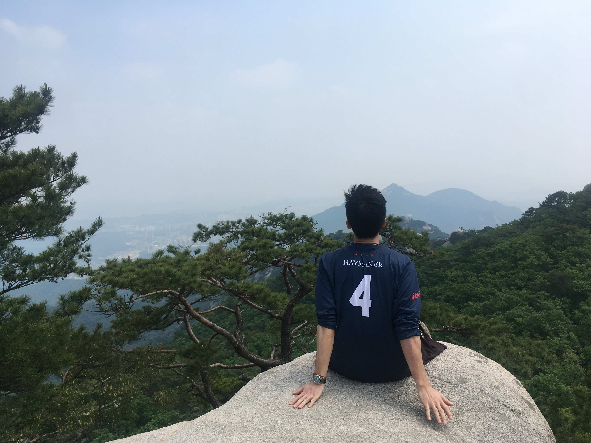

```{r setup, include=FALSE}
knitr::opts_chunk$set(echo = FALSE)

# Learn more about creating blogs with Distill at:
# https://rstudio.github.io/distill/blog.html

```
  

I'm Korean by birth but grew up in several different countries (Scotland, 
Kyrgyzstan, and Germany). I graduated from Knox College and I also have an MD 
from the Medical School for International Health in Be'er Sheva, Israel. I 
started taking programming courses in graduate school because I think it's the 
language of the future.

Here are some fun facts about ME:  
1. I speak 4-ish languages. English, Korean, Russian, and hospital Hebrew.  
2. I was a medic in the Korean Air Force, but I have a special skills badge from the US army.  
3. I taught myself how to play the ukulele - it's still a work in progress.  
4. I have played Ultiamte Frisbee around the world, representing two national teams.  
5. My legal name is Jae Hyoung Lee, but I've been going by Tim since I was 4.  

Recently, I've been fascinated by data visualization and presenting numbers/statistics
in an easily digestible way. [Gapminder](https://www.gapminder.org) is an organization 
founded by Hans Rosling and his children that does this particularly well. 
